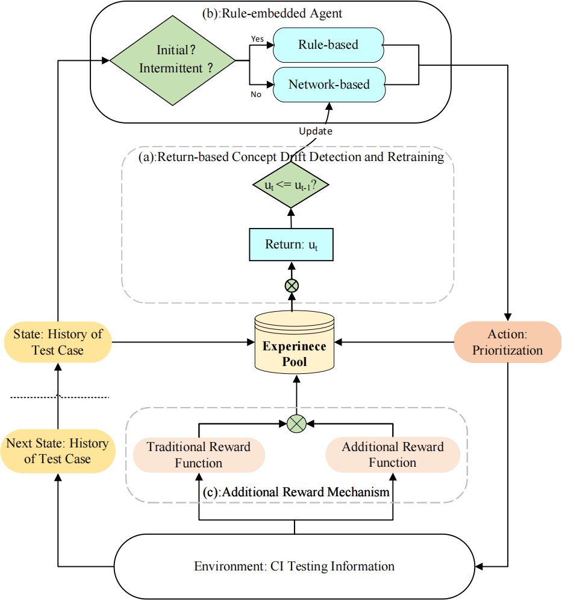

## ARL-CITCP: Adaptive Reinforcement Learning based Test Case Prioritization for Software Continuous Integration
This project contains the experimental code and datasets for ARL-CITCP, an adaptive test case prioritization technique.

ARL-CITCP employs a return-based concept drift detection and retraining method, which not only detects changes in testing objectives but also adjusts the priority of test cases by integrating expert experience. This approach effectively mitigates the problem of concept drift.

The experimental framework diagram of our project is shown below:


### Directory Structure

- `src`: Source code for ARL-CITCP.
- `dataset.zip`: Preprocessed dataset used for the experiment.
- `ARLTCP-Framework.png`: Method framework diagram for ARL-CITCP.

### Requirements

Development environment:

```
Python: 3.10.9
OS: Ubuntu 20.04.6 LTS
```

Third-party dependencies:

```
numpy: 1.23.5
scikit-learn: 1.4.2
pandas: 1.5.3
```

### Execution

Run.py is the main entry file. You can run the ARL-CITCP method using `python Run.py`. The execution results will be stored in the **result** and **result_csv** folders. You can analyze the execution results using `python Statistic.py`, and the statistical results will be saved in **ARL-CITCP.xlsx**.